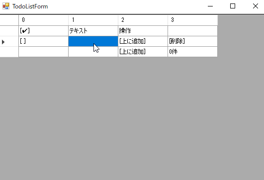

# 仮想グリッド

グリッド上に GUI を構築するためのライブラリ。

仮想 DOM 風の中間表現を使用することにより、宣言的な記述を可能とします。

## スクリーンショット: TODO リストアプリ

- [モデルの実装](./VirtualGrid.WinFormsDemo/Examples/TodoListModel.cs)
- [ビューの実装](./VirtualGrid.WinFormsDemo/Examples/TodoListView.cs)
